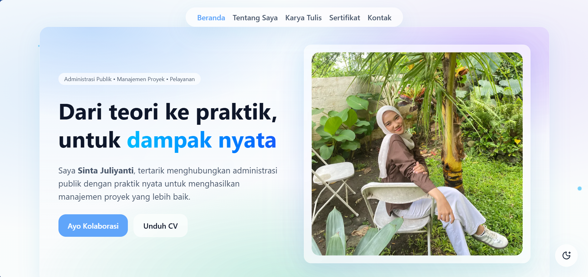

# Client Work Portfolio 

A modern and elegant **portfolio website** built with **Next.js 14, TypeScript, and Tailwind CSS**.  
This project showcases expertise in **Public Administration, Policy Analysis, and Public Service Design**,  
delivered with a sleek UI featuring **aurora gradients, responsive design, theme toggle, particles, and animations**.

---

## Preview

## Features
- **Aurora Gradient Design** — elegant light & dark theme support
- **Fully Responsive** — optimized for desktop, tablet, and mobile
- **Theme Toggle** — switch between light & dark with one click
- **Particles Effect** — smooth interactive particle background
- **Smooth Animations** — powered by Framer Motion & custom effects
- **Timeline Section** — highlight journey & experiences
- **Dynamic Counters** — animated stats with incremental counting
- **Certificates Carousel** — auto-scroll & interactive hover
- **Clean Navigation** — responsive navbar with hamburger menu on mobile

## Tech Stack
- [Next.js 14](https://nextjs.org/) — React framework
- [TypeScript](https://www.typescriptlang.org/) — type safety
- [Tailwind CSS](https://tailwindcss.com/) — utility-first styling
- [Framer Motion](https://www.framer.com/motion/) — animations
- [Vercel](https://vercel.com/) — deployment & hosting

